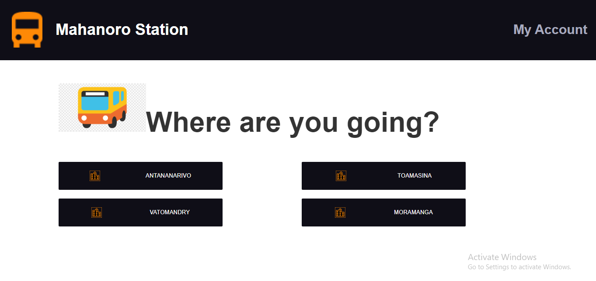
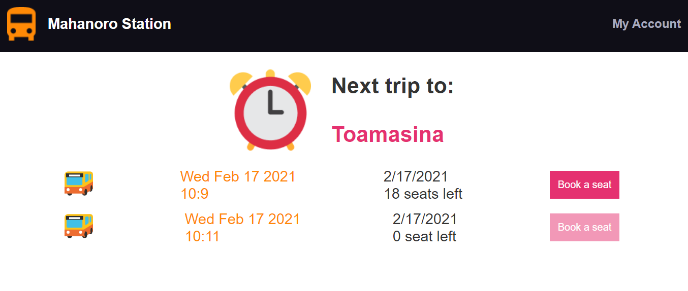
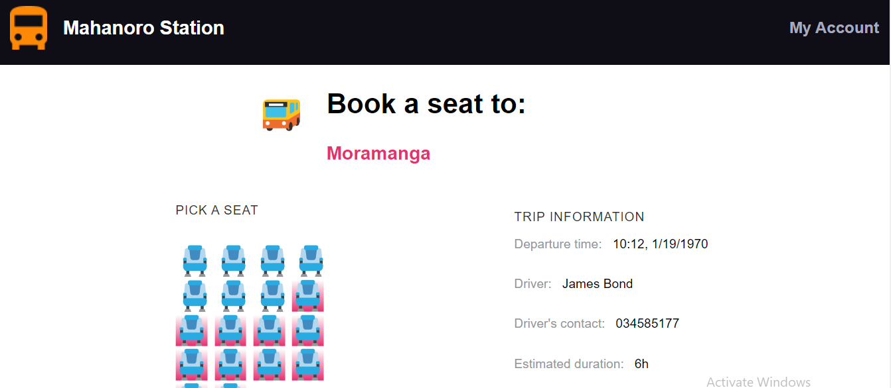
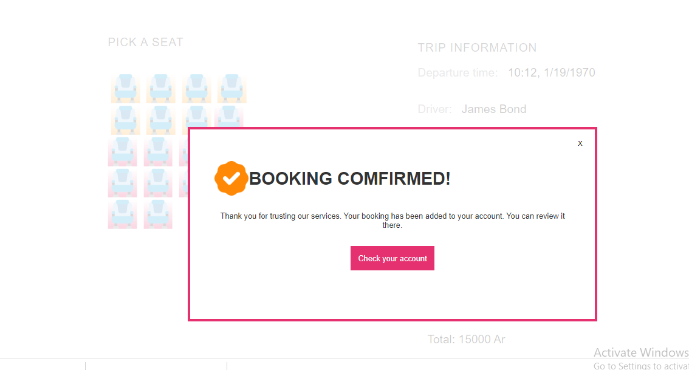
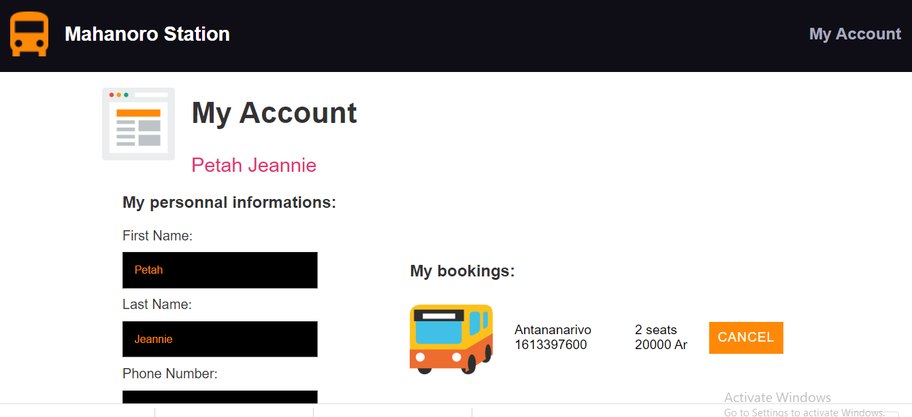

# Graded Project - Mahanoro Station

1- This is the first view, the home page.

2- After clicking one of the city, you find this page

3- Then, you can more details about the trip you choose

4- After you take the seat you see the poppup modal

5- Last you got your account

## Description

### Folder descriptions

- I have a components folder to handle the styles of all display functions and the container to access the functions. 
- I got a page folder just to handle the page's details and the home page. 
Every one of the containers has their own styles inside the components folders

## Functions descriptions

- I have MahanoroStationApp files which handles the main of this code where the router and switch react set. I used Router in this code to keep the link of the homepage and the details work properly.

- My Reducer folder,  that has an index file, is a file which keeps the switch statement and I combine the function that handles the switch to access it in the store. 
  
**The whole demo exists inside of the Mahanoro-station folder.**

## Experience

In this project, I faced quite a lot of struggles to get most of the features.

- Getting the Api links worked by using redux reducer.
- I was struggling to get the seats book working and the valid and not valid seats which are not solved yet.

## What I have learned and improve

- I learned new things by creating a mahanoro-station application and using redux with compound components. It was amazing! 
- I also learned how to use useSelector with useDispatch in useEffect to get the api works.

*Having good name variables and functions are keys to understand more about code. It should always relate to what your functions do and help you to code it and find easily what I should code now. Not only for you to understand but also the others.*

## Some problem

I couldn’t manage to finish the project properly.

## **Live app**

- [live app in netflix](https://mahanoro-station-peta.netlify.app/)
- [github link](https://github.com/Tiaraha-funny/mahanoro-station)
